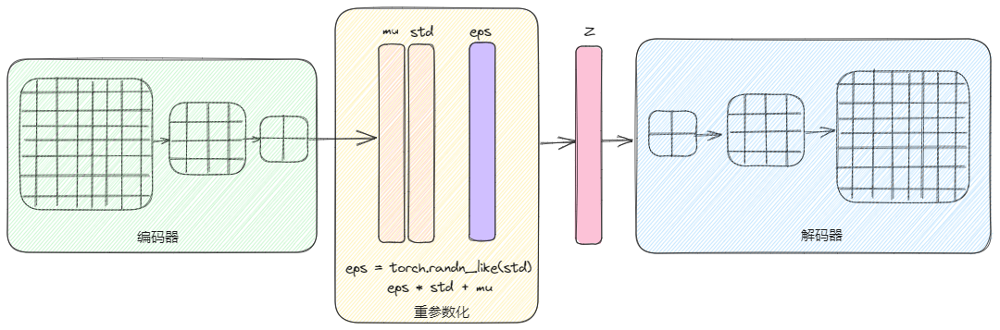

本项目用于训练自己数据集的 VAE 模型，参考地址：https://github.com/AntixK/PyTorch-VA

1. 数据

使用自制数据集，中间一条不规则的黑线

2. 模型

- 编码器：连续使用 CBL 学习图片特征
- 重参数化：对学习的特征，使用正态分布采样
- 解码器：连续的 DC BL，从将采样后的数据，还原回原图

3. 效果

**重建效果**

**生成效果**

4. 结论

- VAE 应用场景有限，待学习的数据要有稳定性，比如 CelebA 数据集，所有图片都有人脸，由于人脸相对稳定，学习比较容易
- 对于一些变化比较大的图片，比如有些图片需要学习亮梯度，有些图片需要学习暗梯度，此时模型就不容易收敛
- 中间隐藏变量不宜过大，一是模型多处使用全连接，导致模型过大，二是模型很容易不收敛
- 待学习的图片不宜过大，原因同上
